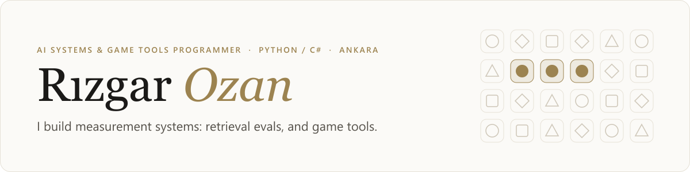
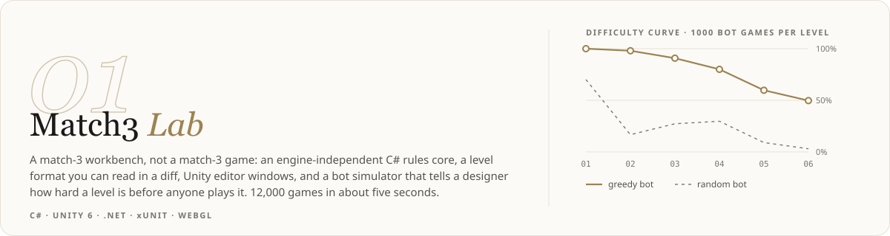
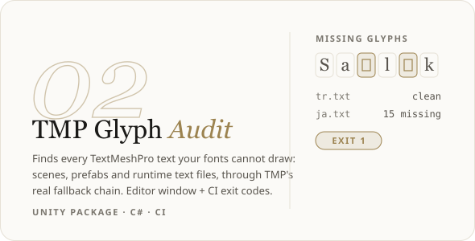
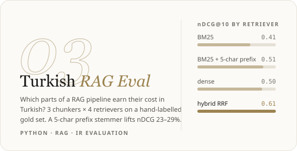
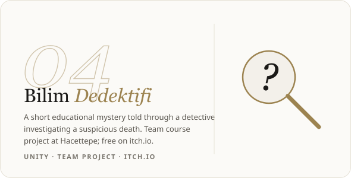
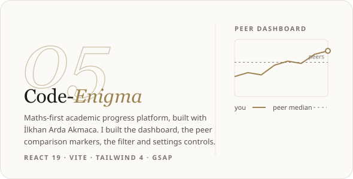
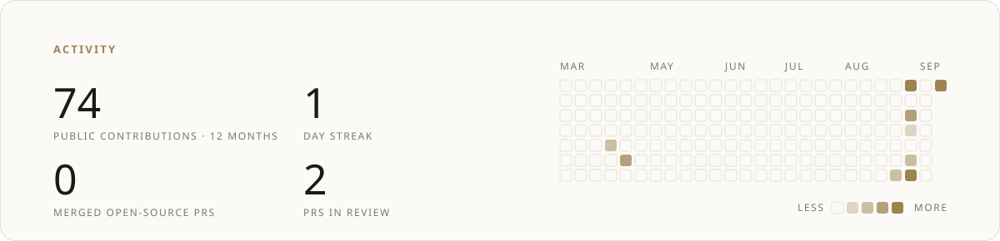

<picture>
  <source media="(prefers-color-scheme: dark)" srcset="assets/header-dark.svg">
  
</picture>

  
  
  
  

I build **systems and the tools around them**: rules engines you can test without an engine
running, editors that show a designer what a change will cost, and simulators that measure
instead of guess. Final-year Computer Education & Instructional Technology student at
Hacettepe University, so I also care about the moment a game teaches something and the player
doesn't notice.

## Selected work

Five projects, in the order I'd show them to you. Every number on a card is copied from the
project's own committed results.

<a href="https://github.com/RizgarOzan/match3-lab">
<picture>
  <source media="(prefers-color-scheme: dark)" srcset="assets/card-match3-lab-dark.svg">
  
</picture>
</a>

<table>
<tr>
<td width="50%" valign="top">
<a href="https://github.com/RizgarOzan/tmp-glyph-audit">
<picture>
  <source media="(prefers-color-scheme: dark)" srcset="assets/card-tmp-glyph-audit-dark.svg">
  
</picture>
</a>
</td>
<td width="50%" valign="top">
<a href="https://github.com/RizgarOzan/turkish-rag-eval">
<picture>
  <source media="(prefers-color-scheme: dark)" srcset="assets/card-turkish-rag-eval-dark.svg">
  
</picture>
</a>
</td>
</tr>
<tr>
<td width="50%" valign="top">
<a href="https://rizgarozan.itch.io/bilim-dedektifi">
<picture>
  <source media="(prefers-color-scheme: dark)" srcset="assets/card-bilim-dedektifi-dark.svg">
  
</picture>
</a>
</td>
<td width="50%" valign="top">
<a href="https://github.com/ilkhanarda/Code-Enigma">
<picture>
  <source media="(prefers-color-scheme: dark)" srcset="assets/card-code-enigma-dark.svg">
  
</picture>
</a>
</td>
</tr>
</table>

Match3 Lab ships a WebGL build, 39 core tests and 2 play-mode tests, and a decision record for every rule.
TMP Glyph Audit: 18 xUnit + 4 EditMode tests. Turkish RAG Eval: 58 hand-labelled queries; differences under 0.05 nDCG are noise, and the README says so.

## Open source

Pull requests to projects I don't own. Refreshed every day by
[a workflow](.github/workflows/profile.yml).

<!-- oss:start -->
**2 in review**

| | Pull request | Project |
|---|---|---|
| 🟢 in review | [docs(reference): add unity_docs and unity_reflect examples](https://github.com/CoplayDev/unity-mcp/pull/1401) | [CoplayDev/unity-mcp](https://github.com/CoplayDev/unity-mcp) · ★ 14.2k |
| 🟢 in review | [docs(reference): add run_tests and get_test_job examples](https://github.com/CoplayDev/unity-mcp/pull/1400) | [CoplayDev/unity-mcp](https://github.com/CoplayDev/unity-mcp) · ★ 14.2k |
<!-- oss:end -->

## Also

- **Suspicious Delicacies** — restaurant sim × turn-based RPG in Unity, three-person team; the restaurant loop, customer AI, QTE minigames and editor tooling are mine
- **[leetcode-solutions](https://github.com/RizgarOzan/leetcode-solutions)** — data structures and algorithms in Python and C#, a few problems every day

## Toolbox

<picture>
  <source media="(prefers-color-scheme: dark)" srcset="assets/stats-dark.svg">
  
</picture>

Header, cards and the activity card are SVGs rendered by <code>scripts/</code> in the site's palette; the cards' text is outlined so they look the same on every machine.
