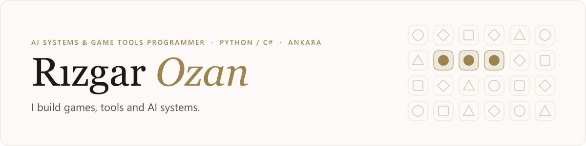
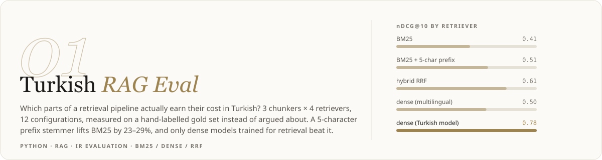
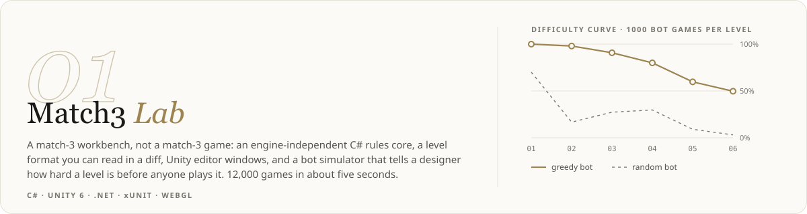
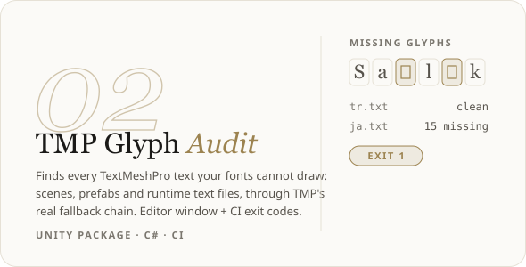
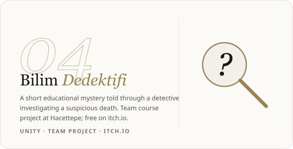
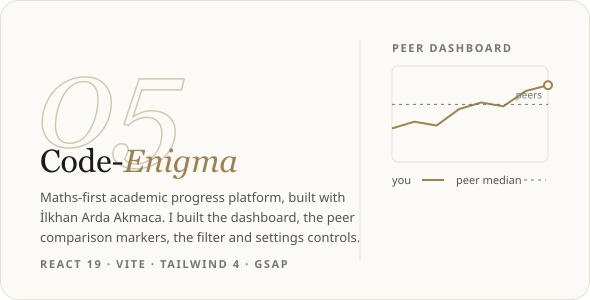

<picture>
  <source media="(prefers-color-scheme: dark)" srcset="assets/header-dark.svg">
  
</picture>

  <a href="https://rizgarozan.github.io">rizgarozan.github.io</a> · <a href="https://www.linkedin.com/in/rizgarozan/">LinkedIn</a> · <a href="https://rizgarozan.itch.io">itch.io</a> · <a href="https://huggingface.co/RizgarOzan">Hugging Face</a> · <a href="mailto:rizgarozan7@gmail.com">rizgarozan7@gmail.com</a>

I build **measurement systems**: retrieval evaluations that say which part of a RAG pipeline
earns its cost, and game tools that score a level or catch a broken font before anyone ships it.
Final-year Computer Education & Instructional Technology student at Hacettepe University, Ankara.

<!-- summary:start -->
**61 pull requests merged** into 17 projects I don't own — mteb, kornia, LightRAG and unity-mcp among them — with 28 more in review.
<!-- summary:end -->

## Selected work

<a href="https://github.com/RizgarOzan/turkish-rag-eval">
<picture>
  <source media="(prefers-color-scheme: dark)" srcset="assets/card-turkish-rag-eval-dark.svg">
  
</picture>
</a>

<table>
<tr>
<td width="50%" valign="top">
<a href="https://github.com/RizgarOzan/match3-lab">
<picture>
  <source media="(prefers-color-scheme: dark)" srcset="assets/card-match3-lab-dark.svg">
  
</picture>
</a>
</td>
<td width="50%" valign="top">
<a href="https://github.com/RizgarOzan/tmp-glyph-audit">
<picture>
  <source media="(prefers-color-scheme: dark)" srcset="assets/card-tmp-glyph-audit-dark.svg">
  
</picture>
</a>
</td>
</tr>
<tr>
<td width="50%" valign="top">
<a href="https://rizgarozan.itch.io/bilim-dedektifi">
<picture>
  <source media="(prefers-color-scheme: dark)" srcset="assets/card-bilim-dedektifi-dark.svg">
  
</picture>
</a>
</td>
<td width="50%" valign="top">
<a href="https://github.com/ilkhanarda/Code-Enigma">
<picture>
  <source media="(prefers-color-scheme: dark)" srcset="assets/card-code-enigma-dark.svg">
  
</picture>
</a>
</td>
</tr>
</table>

## Open source

Fixes sent back to the retrieval and Unity tooling I use, refreshed weekly by [a workflow](.github/workflows/profile.yml).

<!-- oss:start -->
| | Pull request | Project |
|---|---|---|
| 🟣 merged | [docs(reference): add run_tests and get_test_job examples](https://github.com/CoplayDev/unity-mcp/pull/1400) | [CoplayDev/unity-mcp](https://github.com/CoplayDev/unity-mcp) · ★ 14.6k |
| 🟣 merged | [model: add Linkup-Platform/linkup-sparseup-embed-v1](https://github.com/embeddings-benchmark/mteb/pull/5547) | [embeddings-benchmark/mteb](https://github.com/embeddings-benchmark/mteb) · ★ 3.4k |
| 🟣 merged | [fix: read task modalities in result filtering](https://github.com/embeddings-benchmark/mteb/pull/5550) | [embeddings-benchmark/mteb](https://github.com/embeddings-benchmark/mteb) · ★ 3.4k |
| 🟣 merged | [docs(reference): add unity_docs and unity_reflect examples](https://github.com/CoplayDev/unity-mcp/pull/1401) | [CoplayDev/unity-mcp](https://github.com/CoplayDev/unity-mcp) · ★ 14.6k |
| 🟣 merged | [fix(augmentation): place RandomGaussianIllumination's peak at center * L - 0.5](https://github.com/kornia/kornia/pull/4990) | [kornia/kornia](https://github.com/kornia/kornia) · ★ 11.4k |

…and 22 more merged pull requests to Effect-TS, ManimCommunity, TheAlgorithms, e18e, embeddings-benchmark, mdn, modelscope, pylint-dev, radzenhq.
<!-- oss:end -->

## Now · October 2026

- Turkish RAG Eval is at 300 queries (58 hand-labelled, 242 LLM-drafted and double-labelled) across five models, with the dataset on Hugging Face; next is human review of the drafts and an MTEB task.
- Graduating in June 2027; open to internships and new-grad roles in applied AI and game engineering.
